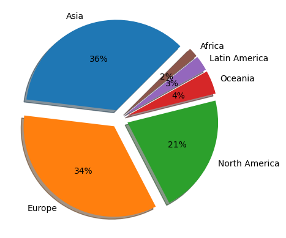

# World University Rankings

## 🔍 Introduction

### **Problem Statement:**
Analyzing global university rankings data to answer the following questions:  
1. Which universities are ranked in the **top 10 globally**?  
2. Which universities are ranked in the **top 10 for employment outcomes**?  
3. What positions do **Saudi Arabian universities** hold within the global rankings?  
4. Considering various factors such as employment rankings, research rankings, and others, which has the **most significant impact** on a university’s overall ranking?  
5. Is there a **correlation between national and global university rankings**? Based on this, can we recommend a country with a high concentration of **top-ranked universities**?  

##  📊 **Dataset Overview**  
- The datasets provided to us were all from 2023, except for Shanghai, which was from 2022. To maintain timeliness, we worked on **Shanghai 2023** after confirming that they used the same **evaluation criteria, weights, and methodology** in both years.  
- **Source:** The dataset was sourced from [World University Rankings - Kaggle](https://www.kaggle.com/datasets/ourfuture/world-university-rankings), and each ranking's credibility was verified.  
- **Ranking Methodologies:**  
  - **Shanghai Ranking (ARWU)**: Uses objective indicators like **Nobel laureates** and **highly cited researchers**.  
  - **CWUR (Center for World University Rankings)**: Focuses on **faculty achievements, research output, and alumni success**, avoiding reputation surveys.  
  - **Times Higher Education Ranking**: Balances **teaching, research, industry income, and international outlook**, using verified university data and independent sources like Elsevier’s **Scopus**.  
  - Their **transparent methodologies** ensure **reliability** in assessing global universities.  

- **Key Differences in Ranking Approaches:**  
  - The **World Ranking dataset** and the **Shanghai dataset** rank universities based on **academic performance**.  
  - The **Times ranking**, however, focuses on **impact** and evaluates **17 different criteria**.  
  - The **first two rankings** use **four main criteria** with different weightings, whereas **Shanghai** further divides these into **six sub-criteria**.  

- **Additional Source:** The Shanghai dataset specifically comes from [Shanghai World University Rankings 2023 - Kaggle](https://www.kaggle.com/datasets/neellad3110/shanghai-world-university-rankings-2023).  

- **Ranking Methodologies Breakdown:**  
  - **Times Ranking**:  
    - Assigned **individual ranks** to the **top 100 universities**.  
    - Universities ranked **101–200** were grouped together.  
    - Subsequent groups were in **increments of 200**, with universities beyond **1001+** labeled as **1001+**.  
  - **Shanghai Ranking**:  
    - Assigned **specific ranks** for the **top 100** universities.  
    - Universities beyond the top 100 were grouped in **increments of 50**, then **increments of 100**.  
  - **World Ranking**:  
    - Assigned a **unique numerical rank** to **each university** from the **first to the last**.  

## 🔍 **Exploratory Data Analysis (EDA)**
### **The following steps were applied to the dataset:**
1. **Data Quality Checking & Remediation:**
   - **Data Cleaning:**  
     - Handling missing/null values and correcting errors.
     - Addressing non-standard entries in ranking fields (e.g., '-' and '.').
   - **Standardization:**  
     - Creating functions to standardize the format of university names.
datasets.
   - **Outlier Handling:**  
     - Identifying and addressing outliers when necessary.
2. **Exploratory Data Analysis (EDA):**
   - **Univariate Analysis:**  
     - Understanding the distribution of individual variables (e.g., Scores, World Rank).
   - **Bivariate & Multivariate Analysis:**  
     - Investigating relationships between variables (e.g., how individual ranking metrics relate to overall performance).
3. **Data Visualizations:**
   - **Over 10 different charts** created using:
     - **Matplotlib, Seaborn**
   - **Unified Style Guidelines:**  
     - Consistent colors, titles, font sizes, axis labels, and legends across all charts.

## 📈 **Key Insights & Visualizations**

### **Top 10 Insights from the Analysis (with Visuals):**

1. **Top 10 Universities by Shanghai Rank 2022**: 

- Harvard leads by a significant margin, showcasing its academic and research dominance.

- Stanford and MIT follow in second and third place, with a noticeable gap from Harvard.

- A gradual decline in scores among the ranked universities, indicating strong competition in the middle ranks.

- Similar scores among the lower-ranked universities, suggesting they are closely matched in performance.

---
2. **Top 10 Universities by Shanghai Rank 2023**: 

- Harvard remains #1 for the second year in a row, solidifying its dominance in global academics and research.

- The U.S. continues to dominate, with 8 of the top 10 universities, reflecting its strong higher education and research ecosystem.

- Cambridge (#4) and Oxford (#7) are the only non-U.S. institutions in the top 10, highlighting the UK’s continued academic excellence.

---

3. **Top 10 Universities by Times Higher Education 2023**: 

- Similar Scores: The universities have nearly identical total scores, indicating close competition.

- Geographic Diversity: The list includes universities from Australia, Canada, and Malaysia, showcasing global excellence.

---
4. **Top 10 Universities by World Rank 2023**: 

- High Scores Across the Board: All universities in the top 10 exhibit total scores close to 100, indicating a high level of academic excellence.

- This suggests that these institutions consistently meet or exceed rigorous standards in teaching, research, and overall impact.

- Consistent Performance: The uniformity in scores indicates that these institutions are competing at a very high level, with minimal differences in overall performance. This consistency highlights the elite status of these universities, making them highly desirable for prospective students.

---
5. **Top 10 Universities by Employability Rank**: 

The chart highlights the top universities globally in terms of graduate employability.
Harvard University ranks the highest with 18.2%, followed by INSEAD with 16.4%.
Other universities, such as the University of Tokyo (9.1%) and HEC Paris (7.3%), show lower percentages.

---

6. **Saudi Universities Ranking (Shanghai Rank 2023)**: 

- Top Ranked: King Saud University and King Abdulaziz University.

- Mid Ranked: King Fahd University and King Khalid University.

- Lowest Ranked: Al Jouf University and Umm Al-Qura University.

---

7. **Saudi Universities Ranking (Times Higher Rank 2023)**: 

- Top Ranked: KAUST and King Faisal University(101–200)

- Mid Ranked: Prince Sultan University(301–400) Qassim University(401–600)

- Lowest Ranked: University of Tabuk and Islamic University of Madinah(1001+)

---

8. **Saudi Universities Ranking  (World Rank)**: 

- Top Ranked: 

King Abdulaziz University(245)

- Mid Ranked: 

Taif University(1509)

Imam Abdulrahman Bin Faisal University(1547)

- Lowest Ranked: 
King Faisal University(1979)

---

9. **Shanghai Rank 2022 Total Score**: 

- The histogram shows a highly skewed distribution, with a majority of universities scoring very low (close to 0). This occurred because of data entry errors.

---

10. **Distribution of University Foundation Years**: 

- Outliers (Year 0): A few universities are marked as being founded in the year 0, which is likely incorrect or missing data.
- Most universities are new: Many universities were built after 1900, especially in the late 1900s.

- Very few old universities: Only a small number of universities were founded before 1800.

- Education grew fast recently: Most universities today are from the last 100 years.

---

11. **Key Factors Influencing University Rankings**: 

- Research Rank (0.90) has the strongest impact on World Rank.

- Weak correlation between Employability (-0.17) and World Rank.

- Moderate correlation between Educational (0.35) and Faculty Rank.

- Improving research output is key for better World Rank.

---

12. **The country with the most universities in the top 100**: 

- USA Dominance: The USA has the highest number of top-ranked universities (World Rank ≤ 100), significantly outperforming other countries.

- Global Spread: Countries like the UK, China, and Germany follow but with much fewer top universities compared to the USA.

- Moderate National-World Rank Correlation (0.35): National rankings only moderately correlate with world rankings, indicating local and global criteria differ.

---
13. **Global Distribution of Universities by Region (Shanghai 2023)**: 

- Asia Dominates (36%): Asia has the largest share of universities in the Shanghai 2023 rankings.

- Europe (34%) and North America (21%): Europe and North America also have significant representation but are behind Asia.

- Minimal Representation: Regions like Africa (2%), Latin America (3%), and Oceania (4%) have minimal contributions.

---

14. **Number of Universities in Asian Countries (Shanghai 2023)**: 

- China Leads Significantly: China dominates with the highest number of universities in the Shanghai 2023 ranking for Asia.

- Japan and South Korea Stand Out: These countries also have a notable number of universities but far fewer than China.

- Other Countries Lag: Countries like India, Singapore, and Saudi Arabia have a smaller presence in the rankings.

## 💡 **Conclusion**
Our analysis revealed that U.S. universities dominate global rankings, with Harvard, Stanford, and MIT consistently securing top positions due to their strong research output, faculty achievements, and academic excellence. Employability rankings, however, show a more diverse distribution, with universities from France, Japan, and Australia performing strongly. Saudi universities are gaining recognition, particularly in research and education rankings, with King Abdulaziz University and KAUST leading the region. Research rank was found to have the strongest correlation with overall university rankings, emphasizing its critical role in global positioning. Lastly, China leads Asia in the number of ranked universities, reflecting significant growth in higher education. These insights can guide students, researchers, and policymakers in making informed decisions about academic institutions worldwide.

---
## Presentation Link
[World University Rankings Presentation](https://bit.ly/3CUr14v)

## 👤 Team Members:

- Ahmed Alhassar
- Emtnan Alomireni
- Naser Almanaa
- Rahaf Alotaibi
